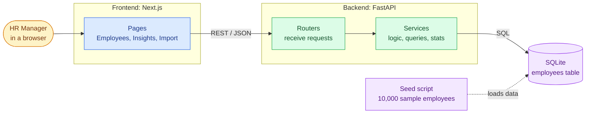

# Design Notes: Salary Management Tool

Companion to `REQUIREMENTS.md`. It records the main technical decisions and why they were made.

## 1. Architecture



**How to read it:** the HR Manager uses the web pages; the pages call the backend over a REST API; the backend runs SQL against one SQLite database; the seed script fills that database with sample data.

**Layering (backend):** `routers` handle HTTP only (parse request, return response) -> `services` hold business logic and query building -> `models` map to the database. Pydantic `schemas` define the request/response shapes and the validation rules. Each layer can be tested on its own, and the database session is injected so tests use an in-memory SQLite.

## 2. Repository layout

The repository root holds three folders: `backend/`, `frontend/` and `docs/` (project-wide documentation), plus a `README.md` that links to everything.

```
salary-management-tool/
├── README.md                  setup, run, test, deploy, links to docs
├── .gitignore
├── .vscode/                   settings.json, extensions.json
│
├── docs/                      REQUIREMENTS.md, DESIGN.md, AI_USAGE.md, PERFORMANCE.md
│
├── backend/
│   ├── app/
│   │   ├── main.py            FastAPI app, CORS, router registration
│   │   ├── seed/              data.py (roles, pay bands, names), generator.py, loader.py, __main__.py
│   │   ├── core/              config.py, database.py (engine, session, pragmas), currency.py
│   │   ├── models/            employee.py (table + indexes)
│   │   ├── schemas/           employee.py, insights.py, imports.py (Pydantic + validation)
│   │   ├── routers/           employees.py, insights.py, meta.py, imports.py
│   │   └── services/          employees.py, insights.py, stats.py, importer.py
│   ├── tests/                 conftest.py + one test file per area
│   ├── requirements.txt
│   └── pytest.ini
│
└── frontend/
    ├── src/
    │   ├── app/               Next.js routes: employees/, insights/, import/, layout.tsx
    │   ├── components/        ui/ (shadcn), employees/, insights/, filters/, import/, layout/
    │   ├── hooks/             use-employees.ts, use-employee-mutations.ts, use-insights.ts, use-debounce.ts
    │   └── lib/               api.ts (API client), types.ts, format.ts, employee-query.ts (table state), peer.ts (peer comparison), employee-rules.ts (form validation), form-errors.ts, employee-schema.ts, insights-query.ts, insights-stats.ts, utils.ts; *.test.ts beside them
    ├── public/
    ├── .env.example           NEXT_PUBLIC_API_URL
    └── package.json, tsconfig.json, next.config.ts
```

**Why this shape:** `docs/` is shared by both sides, so it sits at the root rather than inside either one. Each side is self-contained (its own dependencies, tests and config), so it can be built, tested and deployed on its own. Inside the backend, folders are named for their layer; inside the frontend, for their role (routes, components, data hooks, utilities).

## 3. Data model

One table is enough for the stated scope.

| Column | Type | Notes |
|---|---|---|
| id | integer PK | |
| full_name | text, required | 1-120 chars, trimmed |
| email | text, unique | stored lowercase (so unique is case-insensitive; a database check enforces it), valid format |
| job_title | text, required | indexed |
| department | text, required | indexed |
| country | text (ISO-2) | indexed, must be a supported country |
| currency | text (ISO-4217) | must match the country's currency |
| salary | integer | annual, whole units of local currency, > 0 and at most 1,000,000,000 |
| hire_date | date | not in the future and not before 1950 |
| created_at, updated_at | datetime | |

**Indexes:** `country`, `department`, `job_title`, plus composites `(country, job_title)` and `(country, department)` because the most common questions combine them. `email` has a unique index.

**Why integers for salary:** floats cause rounding errors in money. Annual salaries are whole numbers in practice, so an integer is exact and fast to aggregate.

**Currency rules:** `currency_rates` is a static Python dict (units of USD per 1 unit of local currency) in `core/currency.py`, with a country -> currency map. Static rates keep tests deterministic. Rates are applied inside SQL (a generated `CASE` expression), so USD aggregation also happens in the database.

## 4. API

All paths are under `/api`.

| Method and path | Purpose |
|---|---|
| `GET /employees` | List. Query: `page`, `page_size` (max 100), `q` (name/email), `country`, `department`, `job_title`, `sort`, `order`. Returns `{items, total, page, page_size, peer_stats}` |
| `POST /employees` | Create (validated) |
| `GET /employees/{id}` | Read one |
| `PUT /employees/{id}` | Update |
| `DELETE /employees/{id}` | Delete |
| `GET /meta/filters` | Supported countries (code, name, currency), departments and job titles in use, supported currencies (for dropdowns and forms) |
| `GET /insights/summary` | Stats per group. Query: `group_by` (country, department, job_title), optional filters, `basis` (local or usd) |
| `GET /insights/distribution` | Histogram for the filtered set: `bins` (2 to 50) equal-width ranges, counted in the database. `basis=local` needs a country filter |
| `GET /insights/headcount` | Headcount by country, plus average salary in USD |
| `GET /import/template` | Download the Excel template (built last) |
| `POST /import/preview` | Upload a file, validate every row, return the row-level error report (built last) |
| `POST /import/commit` | Re-validate and insert the valid rows (built last) |

**Decisions inside the API:**
- **Sorting is whitelisted** (`full_name`, `job_title`, `department`, `country`, `salary`, `hire_date`). Never put raw user text into an `ORDER BY`.
- **`peer_stats` in the list response:** when the list is filtered by country and job title, the response includes that group's count, median and typical range (P25 to P75), so the HR Manager sees who is above or below their peers without leaving the page. The peer group is "same job title, same country" and deliberately ignores the search text, department filter and paging, so it does not change as the list is narrowed.
- **Mixed-currency guard:** a group statistic across several countries is meaningless in local currency. `basis=local` is only allowed when the result is limited to one country (a `country` filter, or `group_by=country`); otherwise the API returns a 400 with a clear message, and the UI switches to `basis=usd`.
- **Stable paging.** Every sort ends with the employee `id` as a tie-breaker. Without it, rows with equal values (many people share a department or salary) can repeat or vanish between pages. Text columns sort case-insensitively. Sorting by salary across several countries compares raw local amounts, so the UI filters by country first or labels the currency.
- **Search treats `%` and `_` literally**, so typing them cannot turn a search into a wildcard match.
- **One error format.** Not found is `404 {"detail": "..."}`; a request the API refuses to compute (for example local-currency statistics across several countries) is `400 {"detail": "..."}`; a duplicate email is `409 {"detail": "..."}`; invalid input is `422 {"detail": "Validation failed", "errors": [{"field": "salary", "message": "..."}]}`, so the UI can show each message next to its form field.
- **Import is stateless:** `commit` receives the same file again and re-validates it, so no temporary server storage is needed.

## 5. Statistics: median and typical range in SQLite

SQLite has no `MEDIAN` or percentile function. Options considered:
1. Load all salaries into Python and compute there: simple, but breaks the requirement that aggregation runs in the database.
2. **Window functions (chosen), in two queries.** Query 1 is an ordinary `GROUP BY` for count, min, max and average. Python then works out which ranks each group needs for the 25th percentile, median and 75th percentile (a pure function in `services/stats.py`). Query 2 ranks every salary inside its group with the `ROW_NUMBER()` window function and returns only the handful of rows on those ranks; Python interpolates between them. The position maths stays in plain Python, where it is easy to read and to test, instead of integer arithmetic inside SQL.

The interpolation uses the standard linear method: position = (n - 1) x p. Median is p = 0.5 and the typical range is p = 0.25 to 0.75. The tests check the result against Python's `statistics.quantiles(method="inclusive")`, which uses the same method.

## 6. Validation (single source of truth)

Pydantic models in `schemas/employee.py` enforce the rules in section 3. The create/update API and the Excel import use the **same** model, so a row valid in one place is valid in the other. Import collects errors per row (row number, column, message) instead of stopping at the first one.

## 7. Performance plan

| Concern | Approach |
|---|---|
| List < 300 ms | `LIMIT/OFFSET` with a max page size, indexes on filter columns, a separate `COUNT` query |
| Insights < 500 ms | One SQL query per view, composite indexes, SQLite WAL mode |
| Search | `LIKE '%term%'` on name/email; a full scan of 10k rows takes a few milliseconds, so no extra index machinery is needed |
| Seed < 10 s | One transaction, bulk `executemany`, standard library only |
| Import < 30 s | Parse once, validate in memory, bulk insert in one transaction |

A benchmark test file (`tests/test_performance.py`, marked `performance`) seeds the full 10,000 rows and asserts the requirement limits (list under 300 ms, insights under 500 ms) on the median of 5 runs after a warm-up, measured in-process without network. It also records the SQL the app really sends and asks SQLite for its query plan (`EXPLAIN QUERY PLAN`) to prove that filtered queries use the indexes instead of scanning the table. On a slow machine the limits can be relaxed with `PERF_LIMIT_FACTOR` (for example `PERF_LIMIT_FACTOR=2`), and the benchmarks can be skipped with `pytest -m "not performance"`. Known limit: `OFFSET` gets slower on very deep pages; keyset pagination is the next step if the data grows far beyond 10k.

## 8. Seed data

`app/seed/generator.py` uses `random.Random(42)` so every run produces identical data (on the same Python version; tests compare two runs with each other instead of hard-coding values). It is pure Python with no database, and `app/seed/loader.py` does the bulk insert. Run it with `python -m app.seed`. It covers **12 countries across six regions**, roughly 10 departments, and job titles with a salary band each. Salaries come from a USD base band for the title, scaled by a country factor, converted to local currency, plus noise. That produces realistic gaps between countries and within a role. Emails are unique by construction.

| Region | Country (code) | Currency | Salary level vs US (illustrative) |
|---|---|---|---|
| North America | United States (US) | USD | 1.00 |
| North America | Canada (CA) | CAD | 0.85 |
| Europe | United Kingdom (GB) | GBP | 0.80 |
| Europe | Germany (DE) | EUR | 0.80 |
| Europe | France (FR) | EUR | 0.72 |
| Europe | Netherlands (NL) | EUR | 0.82 |
| Asia | India (IN) | INR | 0.30 |
| Asia | Japan (JP) | JPY | 0.70 |
| Asia | Singapore (SG) | SGD | 0.85 |
| Asia-Pacific | Australia (AU) | AUD | 0.85 |
| Middle East | United Arab Emirates (AE) | AED | 0.75 |
| Latin America | Brazil (BR) | BRL | 0.35 |

- **The list is data, not code logic:** countries, currencies and factors live in one table in `core/currency.py` (with the static USD rates). Adding or removing a country is a one-line change there, and validation, dropdowns and seed data all follow.
- **The UK's code is `GB`:** ISO 3166 uses `GB` for the United Kingdom, so the UI shows "United Kingdom" while the database stores `GB`, same applies for Germany (DE).
- **Large local amounts are fine:** JPY and INR salaries are big whole numbers (for example 8,000,000 JPY), which the integer salary column stores exactly. The UI formats each amount with its own currency.
- **Factors and rates are illustrative,** chosen to make the demo data realistic, not real market data.

## 9. Testing strategy

- `pytest` with an in-memory SQLite and a small fixed fixture of about 12 employees with hand-checked statistics.
- Test areas: validation, CRUD, filtering, sorting, pagination edges (first/last/empty page), percentile function, group statistics, USD conversion, seed determinism, import (valid, invalid, duplicate email, wrong columns).
- Rule: no network, no randomness without a seed, no sleeps. The whole suite should run in under 10 seconds.

## 10. Frontend

- **Next.js** (App Router, TypeScript), **Tailwind + shadcn/ui** for components, **TanStack Query** for server data and caching, **Recharts** for charts, **react-hook-form + zod** for forms.
- **Pages:** `/employees` (search with debounce, filters, sortable table, pagination, add/edit dialog), `/insights` (group-by tabs, summary table, histogram, headcount chart), `/import` (built last).
- The UI never holds more than one page of employees in memory. All numbers come from the API.
- **Table logic is pure and tested.** `src/lib/employee-query.ts` holds the table's state and the rules for changing it (any filter goes back to page 1, clicking a column flips its direction, numbers and dates start highest or newest first, page numbers stay in range). `src/lib/peer.ts` decides how a salary compares with its peers. Neither uses React, so Vitest tests them directly (`npm test`). The components only display.
- **Forms (react-hook-form + zod).** The add/edit dialog validates as you submit, with the same rules as the backend. The rules are plain functions in `src/lib/employee-rules.ts` (tested without any library); the zod schema in `employee-schema.ts` only passes them to the form library. The currency is not typed: it follows the country, so the two can never disagree. The salary is typed as text and converted to a whole number when saving, and a preview such as "₹2,400,000" under the box catches a missing zero. If the server still refuses (for example a duplicate email), `form-errors.ts` puts each message next to the field it belongs to. After a save or delete, the cached lists and statistics are refreshed. Deleting asks for confirmation first, because there is no undo in this version.
- **Insights dashboard.** One page answers "how do we pay?": a *group by* switch (country, department, job title), an *amounts in* switch (US dollars or local currency), the same three filters as the list, four headline cards, a summary table, a salary histogram and headcount by country. The table shows count, lowest, typical range (the middle half), median, average and highest, sortable by any column, with a small *spread* chart per row (thin line = lowest to highest, blue box = typical range, tick = median). **Local currency is only offered when it makes sense.** Local amounts compare like with like only inside one country, so that option is disabled (with an explanation) unless a country is chosen or the table has one row per country; the histogram needs a chosen country. If a local view becomes impossible the page quietly shows US dollars and says so, instead of showing the server's 400 error. The headline *highest/lowest median* cards and the spread charts are hidden when rows are in different currencies, because they cannot be ranked. All of this is decided by plain functions in `lib/insights-query.ts` and `lib/insights-stats.ts`, with unit tests.
- **Search waits for a pause in typing** (300 ms) before asking the API, and the old page stays on screen while the next one loads, so the table does not flash.
- **Peer flags.** When the list is filtered by country and job title, the page shows that group's typical range (P25 to P75) and flags each salary: *above/below range* (outside the middle half) and *far above/far below* (more than 1.5 times the width of that range beyond it, the standard outlier rule), plus how far it is from the median in percent. Groups of fewer than 4 people are not flagged, because quartiles of 2 or 3 people say very little.
- **One API client.** `src/lib/api.ts` is the only code that talks to the backend. Its functions return typed results (`src/lib/types.ts` mirrors the backend schemas) and throw an `ApiError` that carries the server's `{field, message}` list, so forms can show each message next to its field. The API address comes from `NEXT_PUBLIC_API_URL`; `src/lib/format.ts` shows every amount with its own currency.

## 11. Deployment

Backend (FastAPI) on a free host such as Render; frontend on Vercel, with the API address in `NEXT_PUBLIC_API_URL` and CORS configured on the backend (allowed origins come from the `CORS_ORIGINS` environment variable and default to the local dev server, `http://localhost:3000`). The free tier's disk is temporary, so the app seeds itself on first start when the database is empty (under 10 s). Trade-off: data resets on redeploy, which is acceptable for a demo. A production setup would use a persistent database.

## 12. Key trade-offs

| Decision | Alternative | Why this one |
|---|---|---|
| SQLite | PostgreSQL | Zero setup, fast for 10k rows; SQLAlchemy lets us switch later |
| Integer salary in local currency | Store USD only | HR works in local pay; USD is derived on demand |
| Static rates | Live rates API | Deterministic tests, no external dependency |
| Window-function percentiles | Compute in Python | Keeps aggregation in the database |
| Stateless import commit | Server-side upload session | Less moving parts |
| Overwrite on edit | Audit trail | Out of scope; documented in requirements |

## 13. Commit plan

1. `docs: added requirements`
2. `docs: added design notes`
3. `chore: added .gitignore and VS Code workspace settings`
4. `chore(backend): scaffold FastAPI app with health check and pytest`
5. `feat(backend): employee model, indexes and currency table`
6. `feat(backend): validation schemas with tests`
7. `feat(backend): employee CRUD with tests`
8. `feat(backend): list with search, filters, sorting, pagination and tests`
9. `feat(backend): deterministic seed script with tests`
10. `feat(backend): percentile and group statistics with tests`
11. `feat(backend): insights endpoints (summary, distribution, headcount), meta filters and list peer_stats, with tests`
12. `test(backend): performance benchmark on 10k rows`
13. `chore(frontend): scaffold Next.js with Tailwind, shadcn/ui, API client and app shell` (preceded by a small `feat(backend): enable CORS for the frontend`)
14. `feat(frontend): employee table with search, filters and pagination`
15. `feat(frontend): add and edit employee forms`
16. `feat(frontend): insights dashboard`
17. `feat(backend): Excel/CSV import service and endpoints with tests`
18. `feat(frontend): import page with template download and error preview`
19. `chore: deployment configuration`
20. `docs: README, AI usage log and demo link`
